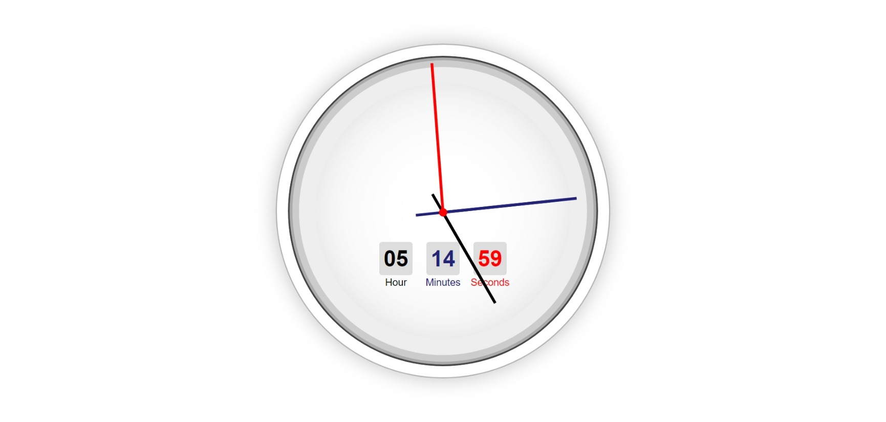

# JavaSrcipt30 (Build A Clock)

This is my code of the "Build A Clock" tutorial of JavaScript30.

## Table of contents

- [Overview](#overview)
  - [The challenge](#the-challenge)
  - [Screenshot](#screenshot)
  - [Links](#links)
- [My process](#my-process)
  - [Built with](#built-with)
- [Author](#author)

## Overview

### The challenge

Build a Clock:
- it should be able to show current hour, minute and seconds.

### Screenshot

### Links

- Live Site: ---> [LINK]()

## My process

### Built with

- Semantic HTML5 markup
- CSS custom properties
- Javascript

## Author

- Twitter - [@godking_jay](https://www.twitter.com/godking_jay)